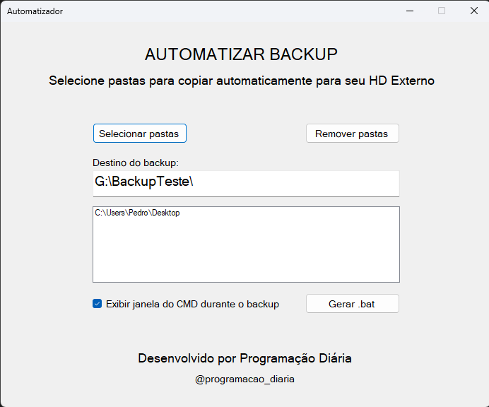

# Software para realizar backup automaticamente em HD Externo

## Objetivo
Aplicação WinForms para configuração de backup automático no Windows. Permite selecionar, adicionar e remover diretórios por meio de uma interface gráfica e gerar um arquivo .bat com regras de backup utilizando o robocopy, que pode ser agendado para execução automática na inicialização do computador. O sistema não utiliza banco de dados e tem como objetivo principal automatizar o processo de cópia de arquivos (equivalente ao Ctrl+C / Ctrl+V), garantindo que o backup seja realizado de forma automática sempre que o usuário ligar o computador.

### Interface Gráfica do Sistema
A interface foi desenvolvida para ser simples, objetiva e fácil de usar, evitando qualquer complexidade desnecessária.

O sistema conta com três botões principais:
- Selecionar pastas: permite ao usuário selecionar uma pasta por vez, possibilitando adicionar várias pastas que serão incluídas no mesmo arquivo ***.bat***.
- Remover pastas: permite remover um diretório previamente selecionado da lista.
- Gerar .bat: após a configuração, gera o arquivo final ***.bat*** com as regras de backup.

Além disso, o sistema possui:
- Um **campo de texto (TextBox)** para informar o destino do backup.
- Um **CheckBox** que permite ao usuário definir se o backup será executado minimizado (em segundo plano) ou **maximizado**, exibindo as informações do processo durante a execução.

  

### Tecnologias e Ferramentas
O sistema foi desenvolvido utilizando **C# com Windows Forms (.NET)**, permitindo a criação de uma aplicação desktop leve, estável e compatível com ambientes Windows. A escolha do WinForms se deu pela sua simplicidade, desempenho e facilidade de distribuição em diferentes máquinas.

Para persistência das configurações, foi utilizado **JSON** por meio da biblioteca ***System.Text.Json***, eliminando a necessidade de banco de dados. Dessa forma, as informações de diretórios selecionados, destino do backup e preferências do usuário são armazenadas localmente de forma simples e portátil.

A automação do processo de backup é realizada através da geração de um **arquivo** ***.bat***, que utiliza o comando **Robocopy**, ferramenta nativa do Windows projetada para cópia de arquivos robusta e confiável. O Robocopy garante tolerância a falhas, repetição automática em caso de erro e suporte a grandes volumes de dados.

O sistema também faz uso de recursos nativos do **Windows Command Prompt (CMD)** e **PowerShell**, permitindo:
- Execução do backup em modo minimizado
- Elevação automática de privilégios para execução como administrador
- Criação de logs de execução

Para distribuição da aplicação, foi utilizado o **Inno Setup**, responsável por gerar um instalador profissional, configurando atalhos, permissões administrativas e estrutura de pastas automaticamente.

Por fim, a integração com o **Agendador de Tarefas do Windows** permite que o backup seja executado automaticamente na inicialização do sistema, tornando o processo totalmente transparente para o usuário final.

### Fluxo de Uso do Sistema
Ao iniciar a aplicação, o usuário tem acesso a interface gráfica, projetada para facilitar a configuração do backup automático sem necessidade de conhecimentos avançados.

**1. Definição do destino do backup**
O primeiro passo é informar, no campo de texto, o diretório de destino onde os arquivos serão copiados (exemplo: HD externo, pendrive ou outra partição do computador).

**2. Seleção dos diretórios de origem**
Utilizando o botão **Selecionar pastas**, o usuário pode escolher, uma a uma, as pastas que deseja incluir no backup. Cada diretório selecionado é adicionado à lista e armazenado automaticamente no arquivo de configuração.

**3. Gerenciamento das pastas selecionadas**
Caso seja necessário, o usuário pode remover qualquer diretório da lista através do botão **Remover pastas**, garantindo total controle sobre o que será copiado.

**4. Configuração do modo de execução**
Por meio de um **CheckBox**, o usuário define se o processo de backup será executado com o terminal visível (exibindo o progresso e as informações do Robocopy) ou de forma minimizada, sem interferir no uso do computador.

**5. Geração do arquivo de automação (.bat)**
Após concluir as configurações, o botão **Gerar .bat** cria automaticamente o arquivo ***backup_automatico.bat***, contendo todas as regras necessárias para a execução do backup, incluindo:
- Diretórios de origem
- Diretório de destino
- Criação de logs
- Execução com privilégios de administrador
- Comportamento visual (minimizado ou visível)

**6. Execução automática**
O arquivo ***.bat*** gerado pode ser executado manualmente ou importado no **Agendador de Tarefas do Windows**, permitindo que o backup seja realizado automaticamente na inicialização do sistema ou em horários definidos pelo usuário.

Esse fluxo garante que o processo de backup seja confiável, automatizado e transparente, reduzindo a necessidade de ações manuais repetitivas e minimizando o risco de perda de dados.